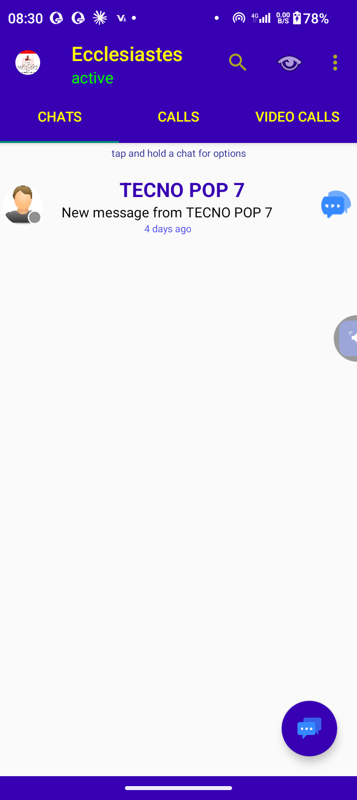
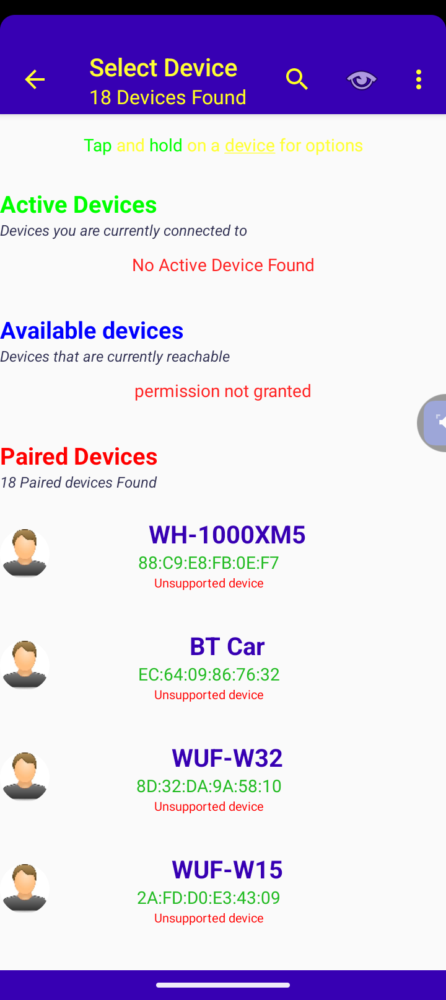
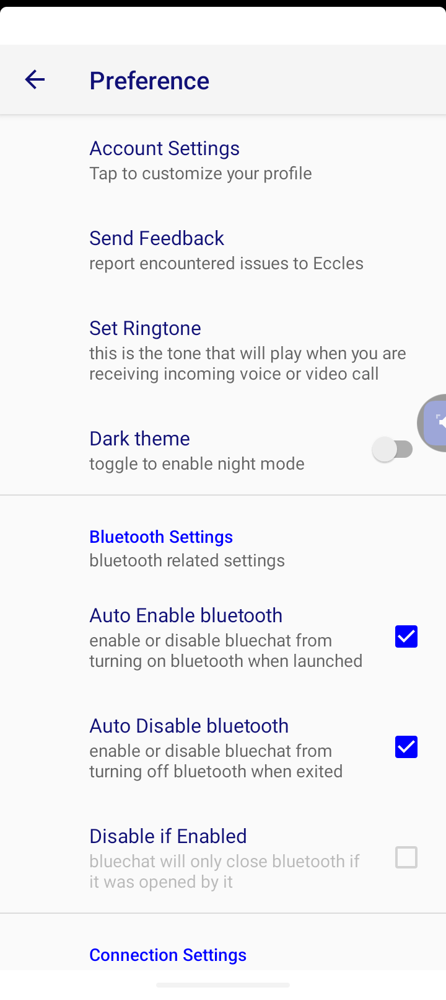
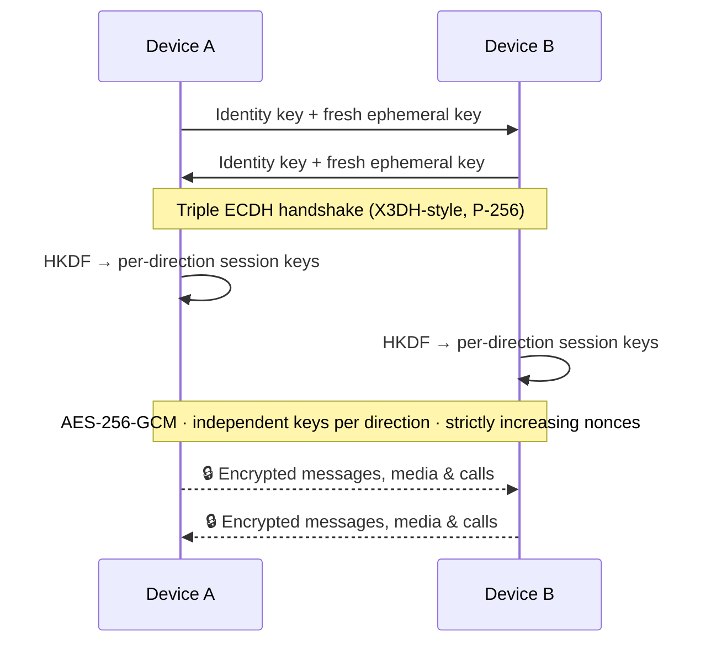

<div align="center">

# 🔵 Eccles BlueChat

### End-to-end encrypted chat, voice & video — carried entirely over Bluetooth.

**No internet. No server. No account. No trace.**

[]()
[]()
[]()
[]()
[](LICENSE)
[](CONTRIBUTING.md)

</div>

---

### 🚧 Active Development

The E2EE hardening pass — new wire protocol, full at-rest encryption, trust-on-first-use pairing — **compiles and runs**, and is now being put through its paces across different devices. This is a fast-moving, pre-release codebase, and that's exactly why it needs you.

📦 A built APK will land under **[Releases](../../releases)**.
🙌 **Contributors are genuinely wanted** — device testers, crypto reviewers, bug hunters, all welcome. Jump to [Contributing](#-contributing).

---

## 📸 See It In Action

<div align="center">
<table>
<tr>
<td align="center"><br/><sub><b>Chats</b></sub></td>
<td align="center"><br/><sub><b>Select Device</b></sub></td>
<td align="center"><br/><sub><b>Preferences</b></sub></td>
</tr>
</table>
</div>

---

## 💡 Why Eccles BlueChat

Every mainstream "private" messenger still routes through someone else's server. That server is a single point of failure — for outages, for breaches, for subpoenas, for shutdowns.

**Eccles BlueChat removes it entirely.** Two phones pair directly over Bluetooth and talk to each other, peer-to-peer, with no third party ever in the loop. If it isn't on one of the two devices, it doesn't exist anywhere.

---

## 🔐 End-to-End Encryption — The Core of This App

This isn't "encryption as a feature." Encryption *is* the app. Every byte that crosses the Bluetooth link — text, photos, voice, video, calls — is protected by a modern, authenticated protocol built from the ground up for this project.

### How a session gets secured



### The full security stack

| 🧩 Layer | 🛡️ What protects it |
|---|---|
| **Handshake** | Authenticated triple-ECDH (X3DH-style) over P-256, combining a long-term identity key with a fresh ephemeral key every session — giving both **forward secrecy** and **implicit authentication** |
| **Session traffic** | **AES-256-GCM**, independent keys per direction, strictly increasing nonce counters — replayed packets are rejected outright, not just detected |
| **Message integrity** | GCM's own authentication tag *is* the tamper check — no bolted-on checksum, no weaker legacy fallback |
| **Identity keys** | Generated once per install, wrapped by an **AndroidKeystore**-backed AES-GCM key, stored outside backup/restore entirely |
| **Peer trust** | **Trust-on-first-use** fingerprint pinning — the same MITM-detection model used by Signal and SSH. If a contact's fingerprint ever changes, you get an explicit warning *before* anything reconnects |
| **At-rest storage** | Messages **and** every piece of media (photos, voice notes, video) individually encrypted on disk with AndroidKeystore-backed AES-256-GCM keys |
| **Decrypted cache** | Media is only ever decrypted into a **non-backed-up, cache-only** temp copy for viewing/playback — and that cache is wiped on every app start |

### What this buys you

- 🕵️ **No server-side database to breach.** There isn't a server.
- 🔁 **Forward secrecy.** Compromising one session's keys doesn't unlock past or future sessions.
- 🚨 **Active tampering is detected, not silently accepted.** Both in-transit (GCM auth tags) and long-term (fingerprint pinning).
- 💾 **A stolen or seized phone doesn't hand over your chat history.** Everything on disk is encrypted at rest, keyed to that device's Keystore.

> ⚠️ **Honesty matters here.** This is hand-rolled protocol code. It has not yet had an independent cryptography review. It's built carefully and modeled on well-understood constructions (X3DH, AES-GCM), but "carefully built" isn't a substitute for a second set of expert eyes — see [Contributing](#-contributing) if that's you. Full technical detail on this pass, including every bug found and fixed, lives in [`CHANGES.md`](CHANGES.md).

---

## 🚀 Features

#### 💬 Messaging
- Text, photo, voice-note and video-file messages, all peer-to-peer
- Delivered and encrypted the same way regardless of message type — no "lite" unencrypted fallback path

#### 📞 Calling
- Voice and video calling directly over Bluetooth
- No carrier, no data plan, no internet connection involved at any point

#### 🌐 Offline-First by Design
- Not a "works offline too" afterthought — there is no online mode to fall back to
- Pair, chat, and call anywhere two Bluetooth radios can reach each other

#### 🧼 Nothing Extra
- No ads, no in-app purchases, no analytics SDKs
- No `INTERNET` permission at all — the app is architecturally incapable of phoning home

#### 🔓 Transparent Trust
- Your own device's fingerprint is always visible on the account screen for out-of-band verification
- Fingerprint changes are surfaced explicitly, never silently accepted

---

## 📲 Install

Grab the latest build from **[Releases](../../releases)**. Since this is still being tested across devices, expect frequent updates — and please [report anything odd you hit](#-contributing).

---

## 🛠️ Build From Source

```bash
git clone <this-repo-url>
cd "Eccles Bluechat E2EE"
./gradlew assembleDebug
```

Or just open the folder in Android Studio and hit run.

**Requirements:** Android Studio (recent stable), `minSdk` 26 / `compileSdk` & `targetSdk` 34, and two physical devices for anything Bluetooth-related — emulators won't cut it here.

### 🧪 Tests

```bash
./gradlew test                     # unit tests — local JVM, no device needed
./gradlew connectedAndroidTest     # instrumented tests — needs a real device/emulator
```

---

## 🗂️ Project Structure

```
app/src/main/java/starking/eccles/
├── bluechat/   💬 Activities, services, UI, preferences
├── crypto/     🔐 Handshake, session/key management, trust store
├── data/       💾 Persistence — ChatBase, encrypted storage
├── stream/     📡 Wire protocol read/write (Reader/Writer)
├── receivers/  📶 Bluetooth state, availability
└── util/       🧰 Shared helpers
```

---

## 🧭 What's Left Before This Ships

- [ ] Full connect → chat → call → video testing across a spread of real device pairs and Android versions, including the trust-changed-warning path
- [ ] Automated tests for `Handshake` / `EccSession` — known-answer tests, replay-rejection tests — and wire-protocol framing
- [ ] Encrypt the contact profile-icon store in `ClassicCompat` (currently plaintext) for full at-rest coverage
- [ ] 🔍 **An independent cryptography review** — hand-rolled crypto deserves a second set of expert eyes before it protects real conversations

---

## 🤝 Contributing

Big or small, contributions help. Device testing and cryptography review are the highest-leverage things you can offer right now — see [`CONTRIBUTING.md`](CONTRIBUTING.md) for how to get started.

---

## 📄 License

[MIT](LICENSE) — free to use, modify, and share.

<div align="center">

**Built for conversations that stay between the two people having them.**

</div>
